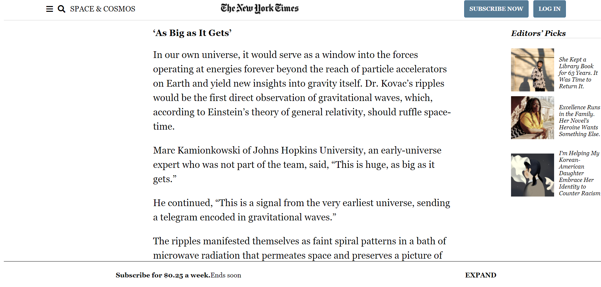

#  New-York-Times-Clone

> Project 1: Positioning and floating elements
Created a New York Times article page clone following the original project specifications from https://www.theodinproject.com/courses/html5-and-css3/lessons/positioning-and-floating-elements

Project requirements included using semantic HTML, aside tag for editor's pick section, aligning elements using a combination of the float, flex and grid techniques.

## Built With

- HTML5
- CSS3

## Live Demo

[Live Demo Link](https://zeenatlawal.github.io/New-York-Times-Clone/)

## Authors

👤 **Zeenat Lawal**

- GitHub: [@ZeenatLawal](https://github.com/ZeenatLawal)
- Twitter: [@lawal_zeenat](https://twitter.com/lawal_zeenat)
- LinkedIn: [Zeenat Lawal](https://www.linkedin.com/in/zeenatlawal/)

## 🤝 Contributing

Contributions, issues, and feature requests are welcome!

Feel free to check the [issues page](https://github.com/ZeenatLawal/New-York-Times-Clone/issues/2).

## Show your support

Give a ⭐️ if you like this project!

## Acknowledgments

- Hat tip to anyone whose code was used
- Inspiration
- etc

## 📝 License

This project is [MIT](https://github.com/git/git-scm.com/blob/master/MIT-LICENSE.txt) licensed.
